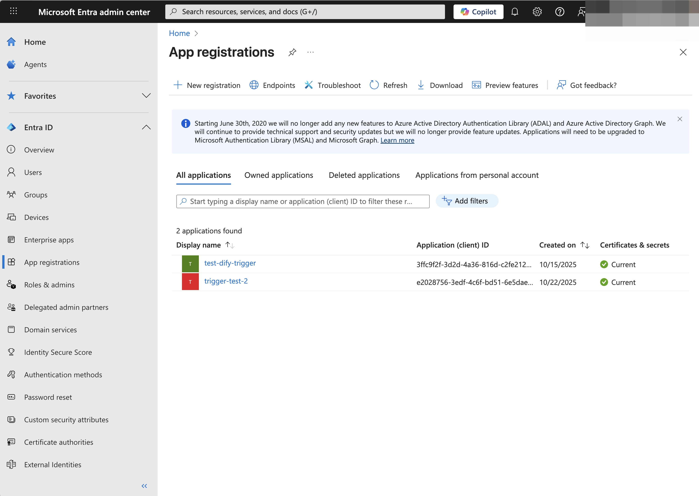
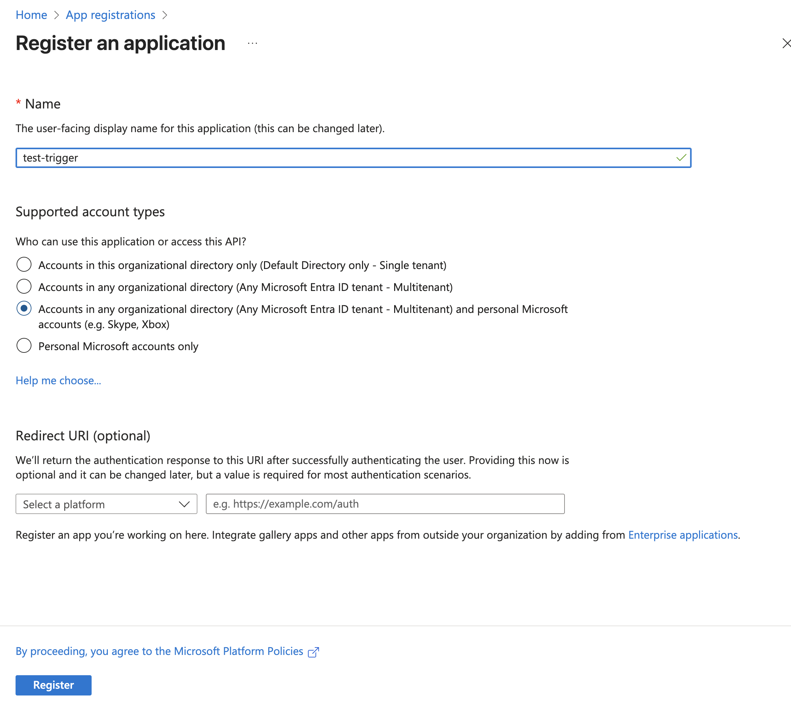
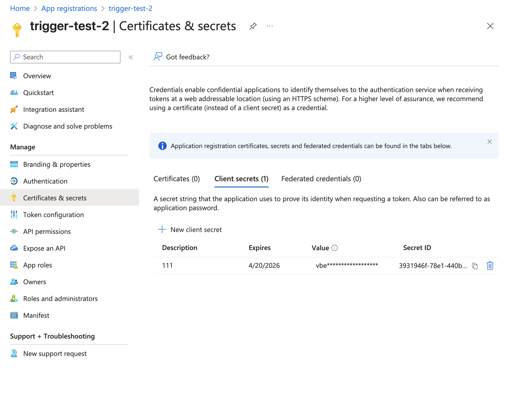
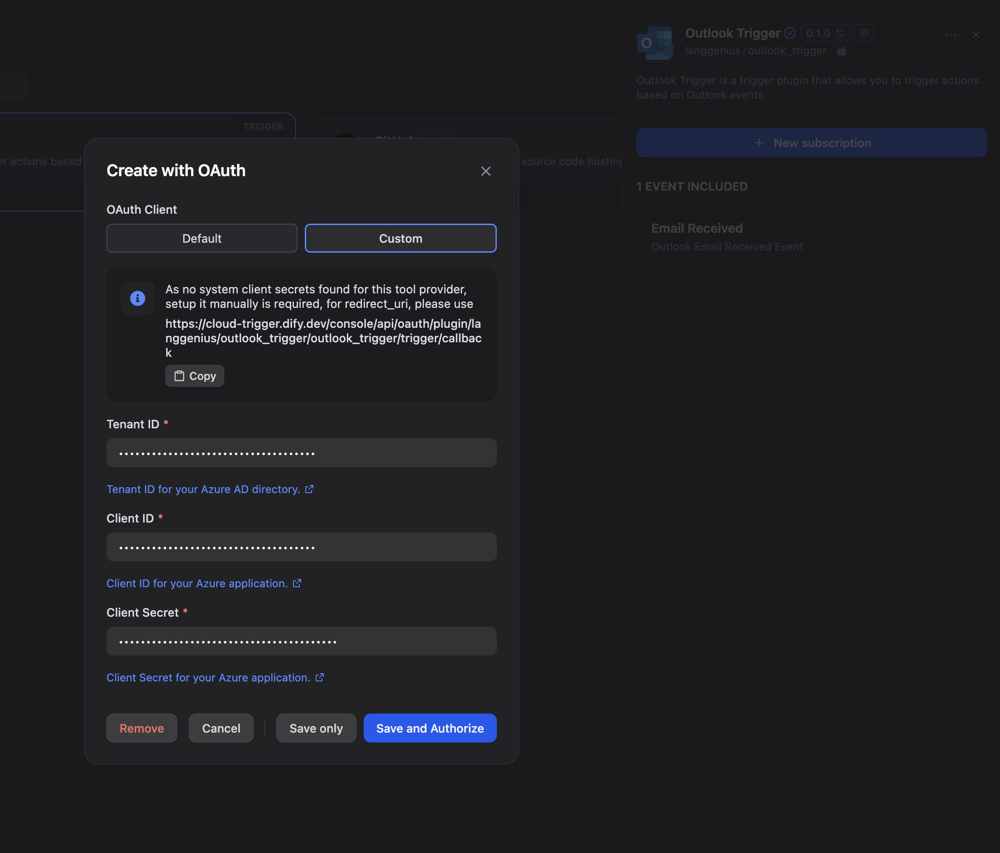
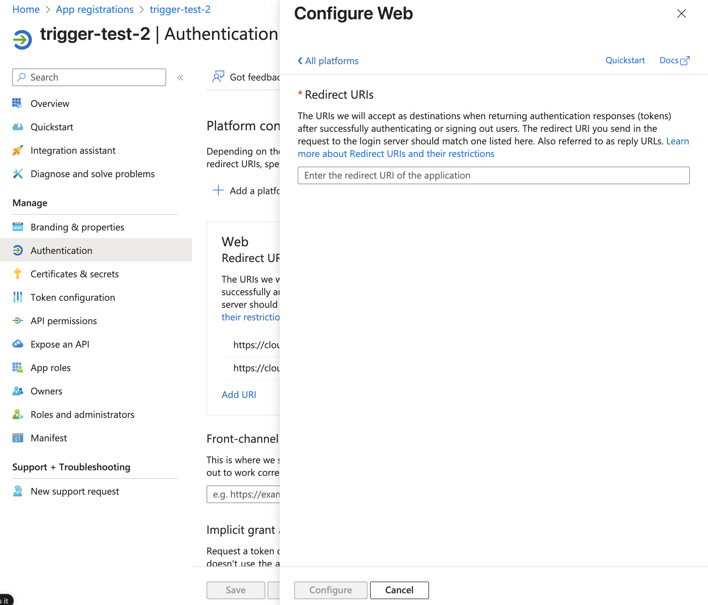

# Outlook Trigger

This trigger receives email received events from Microsoft Outlook and triggers a workflow.

## Upgrade Notes for 1.0.0

Review the saved `Tenant` value after upgrading.
Use a tenant ID or domain for single-tenant apps, `organizations` for work or school accounts only, or `common` only when personal Microsoft accounts are required.
The field remains secret-style in Dify for compatibility with existing saved configurations.

## Set up

1. Enter [Azure Portal](https://portal.azure.com/#home), head to `App Registrations` and create a new application.

Fill with a name and choose the supported account type that matches your tenant policy.
For company-only access, choose single tenant and use the Directory tenant ID in Dify.
For organization-account multi-tenant access, choose accounts in any organizational directory and enter `organizations` in Dify.
Use the personal Microsoft accounts option only when personal accounts are required, then enter `common` in Dify.
Click `Register`.

2. Copy the `Application (client) ID` from the `Overview` page.
Copy the `Directory (tenant) ID` too if you chose single tenant.
Generate a new client secret in the `Certificates & secrets` page and copy the value.

3. Install this plugin in Dify and open configuration page.

Fill in the `Client ID`, `Client Secret`, and `Tenant ID` fields.
The `Tenant ID` value should match your account type choice: your tenant ID or domain, `organizations`, or `common`.

You'll get a `redirect_url` in this dialog, copy it and go back to the Azure Entra ID page, head to `Authentication` page, select `Web` as the platform type, add paste the `redirect_url` in the `Redirect URIs` field. Click `Save`.

Now you can go back to the Dify plugin configuration page and click `Save and authorize` to initiate the OAuth flow.

This plugin will redirect you to the Microsoft login page, login with your Microsoft account and grant the permissions to the application.

Then you can use this plugin in a workflow to trigger it when you receive an email.

## Monitoring a Shared Mailbox

By default, this trigger monitors the inbox of the authorized account. To monitor a shared mailbox instead:

1. Make sure the authorized account has been granted access to the shared mailbox (e.g., Full Access / Read permission in Exchange admin center).
2. The OAuth authorization requests the `Mail.Read.Shared` delegated permission automatically. If your Azure application restricts permissions, add `Mail.Read.Shared` (Delegated) under `API permissions` and re-authorize.
3. When creating a subscription in Dify, fill in the `Shared Mailbox Address` field with the SMTP address of the shared mailbox (e.g., `support@example.com`). Leave it empty to monitor your own inbox.
