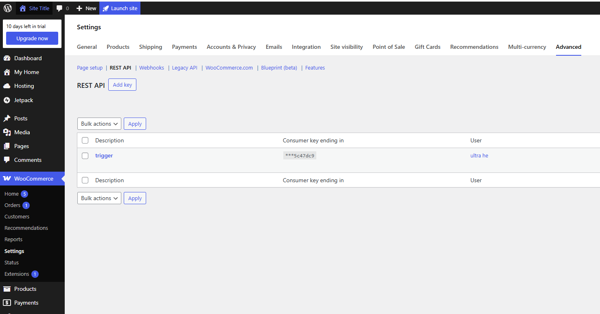

# WooCommerce Trigger Plugin for Dify

A webhook-based trigger plugin that connects WooCommerce stores with Dify workflows.

## Overview

This plugin provisions WooCommerce webhooks (v3 API) and validates each delivery with HMAC SHA-256 signatures. It currently covers store operations such as orders, products, coupons, and customers so you can launch automations the moment commerce events happen.

## Use Cases

### 1. Intelligent Order Follow-up
- **Trigger**: `order_created`
- **Workflow**:
  - Parse line items and payment totals
  - Run fulfilment or fraud checks with LLMs
  - Notify internal channels or generate branded responses automatically

### 2. Catalog Quality Guardrails
- **Trigger**: `product_updated`
- **Workflow**:
  - Compare fields (title, description, price) against brand tone and policies
  - Let an LLM rewrite problematic copy or raise a review task in Dify

### 3. Customer Lifecycle Automation
- **Trigger**: `customer_created`
- **Workflow**:
  - Summarize profile and lifetime value
  - Kick off onboarding or VIP nurturing flows

## Supported Events

- `order_created`, `order_updated`, `order_deleted`
- `product_created`, `product_updated`, `product_deleted`
- `customer_created`, `customer_updated`, `customer_deleted`
- `coupon_created`, `coupon_updated`, `coupon_deleted`

## Configuration

### Prerequisites
1. WooCommerce store with REST API enabled
2. Consumer Key & Consumer Secret generated under **WooCommerce → Settings → Advanced → REST API**
3. Ability to manage webhooks (Store manager or Admin role)

### Setup Steps

1. **Create API credentials**
   - Go to *WooCommerce → Settings → Advanced → REST API*
   - Click *Add key*, select a user with `Read/Write` permission
   - Copy the **Consumer Key** and **Consumer Secret** into the credential form

2. **Install the plugin in Dify**
   - Upload this plugin under *Plugins → Triggers*
   - Provide your store URL (e.g., `https://shop.example.com`)
   - (Optional) Toggle *Include credentials in query* when your host strips the `Authorization` header

3. **Create a subscription**
   - Pick one or more webhook events from the checkbox list
   - (Optional) Provide your own signing secret; otherwise Dify generates one automatically
   - Save the subscription. Dify will create individual WooCommerce webhooks pointing to the generated endpoint and keep the secret for signature validation.

