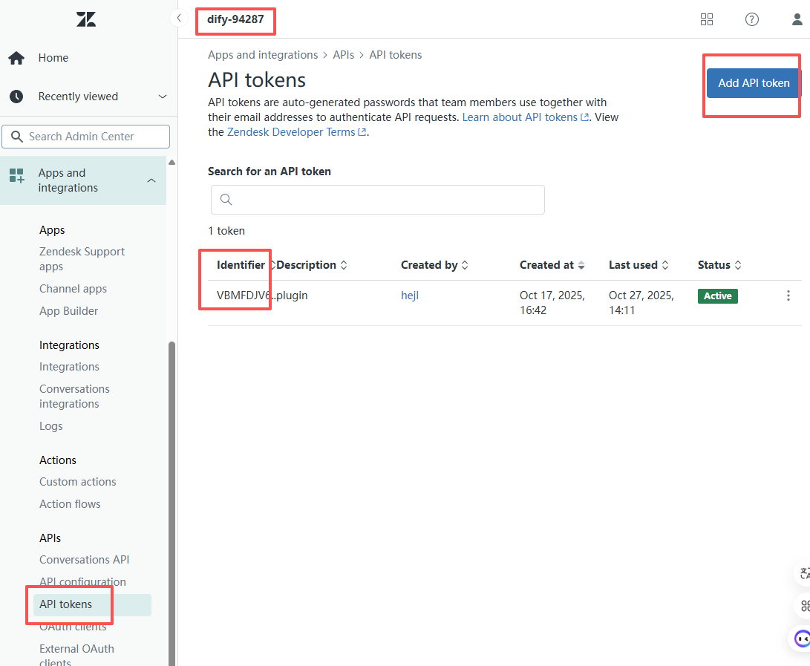
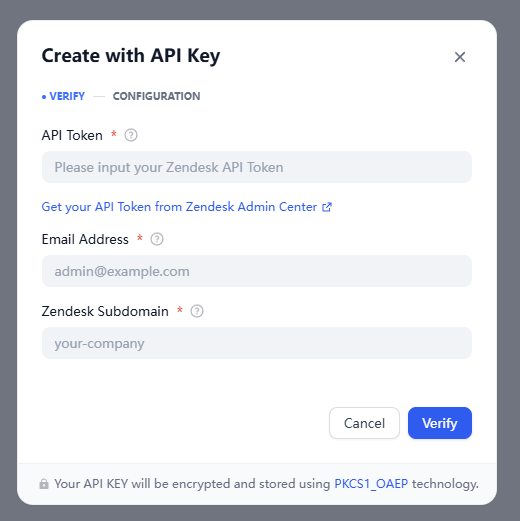
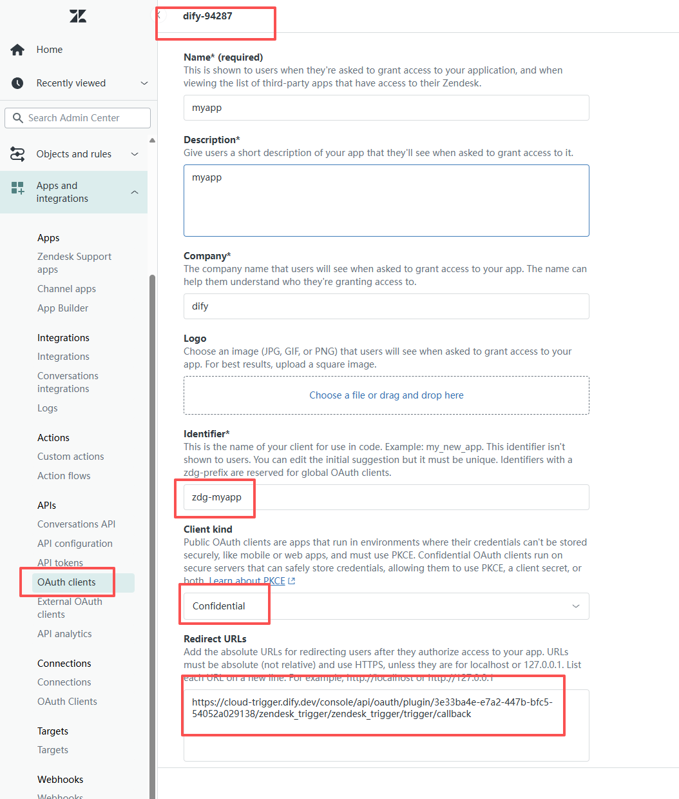
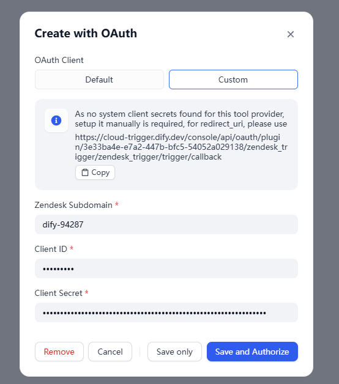

# Zendesk Trigger Plugin for Dify

A comprehensive webhook-based trigger plugin for Zendesk that enables intelligent automation workflows in Dify.

## Overview

This plugin connects Zendesk's customer service platform with Dify's AI capabilities through webhook triggers. It supports various Zendesk events to enable intelligent customer service automation, and knowledge base optimization.

## Use Cases

### 1. Intelligent Ticket Processing
- **Scenario**: Automatically analyze new tickets and route them to the right agent
- **Trigger**: `ticket_created`
- **Workflow**:
  - AI analyzes ticket content, priority, and sentiment
  - Recommends best-fit agent based on expertise
  - Generates initial response suggestions

### 2. SLA Monitoring & Alerts
- **Scenario**: Prevent SLA breaches with proactive alerts
- **Trigger**: `ticket_status_changed`, `ticket_priority_changed`
- **Workflow**:
  - Monitor ticket status transitions
  - Alert when approaching SLA deadlines
  - Trigger automated escalation

### 3. Knowledge Base Optimization
- **Scenario**: Improve help center content based on ticket trends
- **Trigger**: `article_published`, `article_unpublished`
- **Workflow**:
  - Analyze common ticket topics
  - Recommend knowledge base articles
  - Optimize agent efficiency

## Supported Events

### Ticket Events
- **ticket_created**: New support ticket created
- **ticket_marked_as_spam**: Ticket flagged as spam by Zendesk
- **ticket_status_changed**: Ticket status changed (new → open → solved → closed)
- **ticket_priority_changed**: Ticket priority modified (low → urgent)
- **ticket_comment_created**: Comment added to ticket (public or private)

### Knowledge Base Events
- **article_published**: Help center article published
- **article_unpublished**: Help center article unpublished

## Configuration

### Prerequisites
1. Zendesk account with admin access
2. API Token or Oauth client from Zendesk Admin Center
3. Zendesk subdomain (e.g., `acme` for acme.zendesk.com)

### Setup Steps

1. **API Token configurations**

- navigate to `Apps and integrations/Apis/Api tokens`
- add a API token
- config the api to dify

2. **Oauth Client configurations**

- the oauth client config is more complicated, let's compare the two screenshot
- the `Client ID` in dify is the `Identifier` in Zendesk
- the `Redirect URLs` of Zendesk required to copied from dify
- the `Client kind` of Zendesk required choose `Confidential`

## Version History

- **1.0.0** (2025-10-31): Initial release
  - Support for ticket, comment and article events
  - Comprehensive filtering options
  - Webhook signature validation
  - Multi-language support (EN, ZH, JA)
